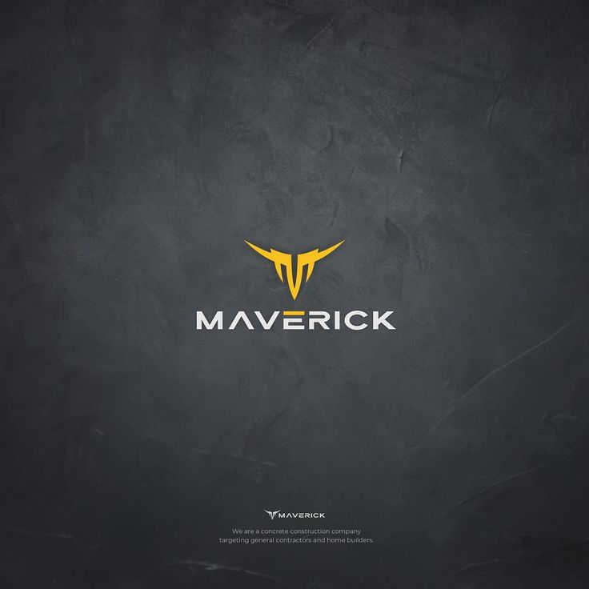

<p align="center">
  <!-- Retro Cyberpunk Banner using your uploaded asset -->
  
</p>

<p align="center">
  <!-- Typing Text Graphic -->
  <a href="https://github.com/mave-rick-24-mj">
    
  </a>
</p>

<p align="center">
  <!-- Dynamic Red vs Blue Status Badges -->
  
  
  
</p>

---

## 📖 Intell

<table align="center" width="100%">
  <tr>
    <td width="25%" align="center" valign="middle">
      <!-- Your Custom Profile Image -->
      
    </td>
    <td width="75%" valign="top">
      <h3>Hey there! I'm M.J 👋</h3>
      <p>I operate at the intersection of offensive execution and defensive telemetry—otherwise known as <b>Purple Teaming</b>. While my primary drive lies in Red Team penetration testing and exploit execution, I am equally focused on Blue Team defensive monitoring. I regularly design labs where I launch targeted exploits in Kali or BlackArch and immediately analyze the forensic footprint on Wazuh SIEM using Sysmon logs.</p>
      <p>This dual approach is backed by my academic journey at <b>Zetech University</b> and my leadership experience as an <b>IT Attachment Team Leader at Thiwasco</b>. I build security solutions that don't just look for attacks, but understand how they work from the inside out.</p>
      <p>When the terminal is minimized, I'm usually hitting the court to play some <b>basketball</b>, keeping up with the high-speed drama of <b>Formula 1</b>, deep-diving into obscure corners of the internet for new ideas, or just trying out completely random tech experiments to see what breaks.</p>
    </td>
  </tr>
</table>

---

## ⚡ Quick Scan 

> *If you are short on time, here is the high-level diagnostic of my profile:*

```bash
mave-rick-24-mj@security-node:~$ query --profile "M.J" --verbose
[🎓] EDUCATION   :: Pursuing Diploma in Cybersecurity @ Zetech University
[🚀] EXPERIENCE  :: Former IT Attachment Team Leader @ Thiwasco
[🔴] RED FOCUS   :: Vulnerability exploitation, payload obfuscation, and wireless auditing
[🔵] BLUE FOCUS  :: Wazuh SIEM integration, Sysmon telemetry, and threat intelligence ingestion
[⚙️] OS DEPLOYED :: Kali Linux, BlackArch, Linux Mint, and Windows Target Sandboxes
[⚡] COFFEE-TIME :: Basketball player, F1 enthusiast, internet deep-dives, & random tinkering
```

## ⚙️ Operating Modes (Environments & Targets)

I adapt my workflow across customized environments depending on the engagement objective:

| Mode | OS Environment | Focus / Use Case |
| :--- | :--- | :--- |
| **🔴 Red Team Ops** | Kali Linux / BlackArch | Active reconnaissance, payload crafting, and exploit delivery. |
| **🛡️ Defensive Blue** | Linux Mint / Debian | Hardening, script writing, security logging, and threat hunting. |
| **🎯 Target Sandbox** | Windows 10/11 / Server | Active telemetry auditing, testing Group Policies, and bypassing defenses. |

## 🛠️ Cyber Security Arsenal

<table align="center" width="100%">
<tr>
<td width="50%" valign="top">
<h3>🔴 Exploitation & Red Teaming</h3>
<p><em>Attacking and validating environments.</em></p>
<ul>
<li><b>Frameworks:</b> Metasploit, Armitage GUI Console</li>
<li><b>Payloads & Obfuscation:</b> msfvenom, Resource Hacker</li>
<li><b>Wireless Auditing:</b> Aircrack-ng, Wireshark Packet Analysis</li>
<li><b>Reconnaissance:</b> Nmap, Open Threat Exchange (OTX)</li>
<li><b>OS Platforms:</b> Kali Linux, BlackArch Linux</li>
</ul>
</td>
<td width="50%" valign="top">
<h3>🔵 SIEM & Blue Teaming</h3>
<p><em>Detecting anomalies and auditing states.</em></p>
<ul>
<li><b>Monitoring:</b> Wazuh SIEM, AlienVault OTX Integrations</li>
<li><b>Compliance:</b> CIS Hardening Benchmarks (Windows 10)</li>
<li><b>Telemetry:</b> Windows Sysmon, Event Logging & Telemetry</li>
<li><b>Hardening:</b> Group Policy Restriction, Credential Auditing</li>
<li><b>Languages:</b> Python, C++ <i>(actively practicing on Exercism)</i></li>
</ul>
</td>
</tr>
</table>

## 📂 Featured Projects (Threat Landscape Analysis)

<table align="center" width="100%">
<tr>
<td width="75%" valign="top">

* 💻 **VULN-EXPLOIT-SANDBOX** — Penetration testing walkthrough mapping host vulnerabilities, privilege escalation, and direct remote control with Metasploit and Armitage GUI.
* 🛡️ **WAZUH-MONITORING-PIPELINE** — Engineered an active threat intelligence pipeline integrating open-source intelligence (OSINT) feeds directly into Wazuh SIEM to audit lightweight agents and trace credential scans.
* 🎭 **PAYLOAD-RESOURCE-MASKING** — Security-awareness simulation using msfvenom and Resource Hacker to swap binary headers and replace payload indicators with harmless PDF templates.

</td>
<td width="25%" align="center" valign="middle">
<!-- Your Custom Cyber Shield Asset -->

</td>
</tr>
</table>

---

## 📟 Establish Handshake

To run security reviews, collaborate on defense architectures, or initiate general penetration testing inquiries:

```bash
mave-rick-24-mj@security-node:~$ mailto mainajoe42@gmail.com
```

<p align="left">
  <!-- Gmail Direct Link -->
  <a href="mailto:mainajoe42@gmail.com">
    
  </a>
  <!-- GitHub Profile Link -->
  <a href="https://github.com/mave-rick-24-mj">
    
  </a>
</p>
